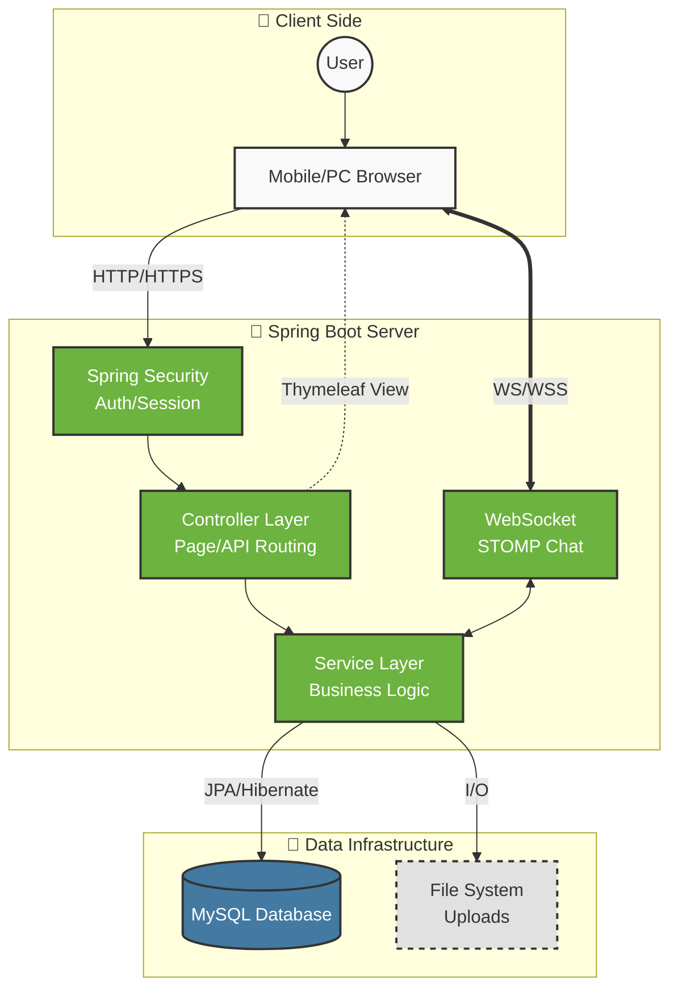

# 🤝 Cmoa (Project Name CV_MOA)
> **Swipe Right for Your Dream Job!**
> 구직자와 채용 담당자를 틴더(Tinder) 방식의 UI로 연결하는 신개념 매칭 플랫폼

**Cmoa**는 딱딱하고 지루한 기존의 채용 프로세스를 벗어나, **직관적인 스와이프(Swipe)** 방식을 통해 구직자와 기업을 연결하는 서비스입니다.

구직자는 기업의 핵심 가치를, 기업은 인재의 포트폴리오를 카드 형태로 확인하며 빠르고 간편하게 서로의 니즈(Needs)를 파악할 수 있습니다. 양쪽이 모두 'Like'를 보냈을 때 비로소 매칭이 성사되어 대화를 시작할 수 있습니다.

*(여기에 실제 스크린샷을 넣으세요)*

### ✨ 주요 기능 (Key Features)
* **Swipe UI**: 좌우 스와이프를 통해 채용 공고/인재 프로필을 간편하게 탐색 (CSS 3D Animation 적용)
* **Super Like**: 100 포인트를 소모하여 상대방에게 강력한 호감을 표시하고, 매칭 확률을 높임
* **Real-time Matching**: 상호 호감이 확인되는 즉시 매칭 알림 전송 및 채팅방 생성
* **Chatting**: 매칭된 구직자와 채용담당자 간의 STOMP 기반 실시간 1:1 대화
* **Premium Insight**: 50 포인트를 사용하여 기업의 면접 꿀팁, 연봉 정보, 조직 문화 등 시크릿 정보 잠금 해제
* **Resume/Portfolio**: 간편하게 등록하고 시각적으로 돋보이는 프로필 카드

 

## 🛠 기술 스택 (Tech Stack)

| 구분 | 기술 (Technology) |
| :-- | :-- |
| **Language** |  |
| **Frontend** |      |
| **Backend** |    -010101?style=flat-square&logo=socket.io&logoColor=white) |
| **Database** |  |
| **Build Tool** |  |
| **Server** |  |

 

## 🏗 시스템 아키텍처 (System Architecture)

더 자세한 기획 의도와 요구사항 명세는 아래 문서를 참고해 주세요.

👉 **[소프트웨어 요구사항 명세서 (SRS) 보러 가기](https://github.com/sorbet0404/CV_MOA/blob/docs/C_MOA_SRS.md)**

 
